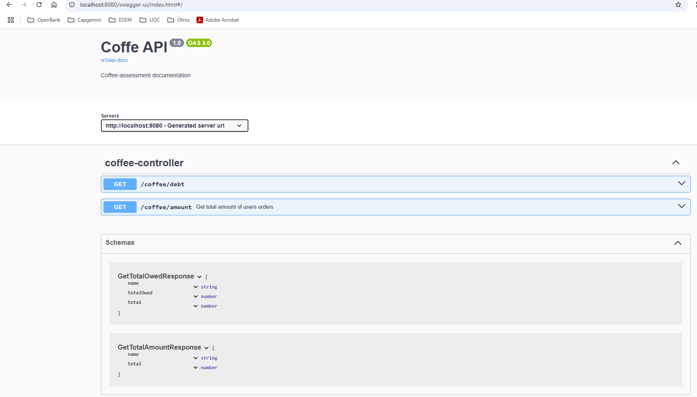

# Developer Assessment

# Summary

This is a simple Spring Boot REST API for tracking coffee payments among users.It provides endpoints to retrieve how
much each user has paid and how much they still owe.
There are two API endpoints:

### GET /coffee/amount

Description:
Returns the total amount that each user has paid for their coffee orders. The result is gotten grouping all the orders
by customer from orders.json and calculating the price of the orders using products.json

Responses:

200 OK: Returns a list of users with their total payments.

404 Not Found: Product provided not found.

500 Internal Server Error: Unexpected error.

### GET /coffee/debt

Description:
Returns the difference between the amount calculated in the previous endpoint and the payments that the user has already
done and that are stored in payments.json. First, the total of the payments for each user is calculates. After that, the
amount of the orders calculated in the previous operation is substracted from the total amount of the payments. A
negative signed result implies that the user has paid more than the debt they have, a positive result implies that they
owe that quantity.

Responses:

200 OK: Returns a list of users with their total payments.

404 Not Found: Product provided not found.

500 Internal Server Error: Unexpected error.

### Requirements

- Java 17+
- Maven

### Build and Run

```bash
mvn clean install
mvn spring-boot:run
```

# Explanation of internal architecture

For the development of this test, the architecture selected is hexagonal architecture. Hexagonal architecture isolates
the domain logic from the components that interact with external systems.
Consequently, if a migration occurs, the domain logic remains unchanged, and only the specific parts of the application
impacted by the migration will need to be modified.
This test has been developed applying SOLID principles, therefore:

- Each class has a single responsibility.
- The system is open to extension but closed to modification: if you want a new functionality, you can add a new use
  case.
- The interfaces have only their needed method.
- Interface segregation: in all the steps of the development to achieve decoupling the code has been segregated in
  interfaces. The allows, for example, that if in the future the Json files that acts as repository want to be changed
  by a database or a queue system it can be done only creating a new implementation of the repositories and injecting
  this new implementations. Also, more than one implementation could exist in the same project and with a factory
  pattern any of them can be chosen. The possibilities of this are very powerful.
- Spring is basen in Dependency injection, the classes are registered in its context and this is used to instantiate the
  objects

Another design decision made is to made POJOs for every layer of the app, this way domain logic remains separated from
the external connections. This can be easily implemented using mapStruct library for the maps.

# Resources to test the app

In resources folder there is a postman collection to test the application.

# Access to swagger documentation

The project's swagger can be consulted in http://localhost:8080/swagger-ui/index.html#/
